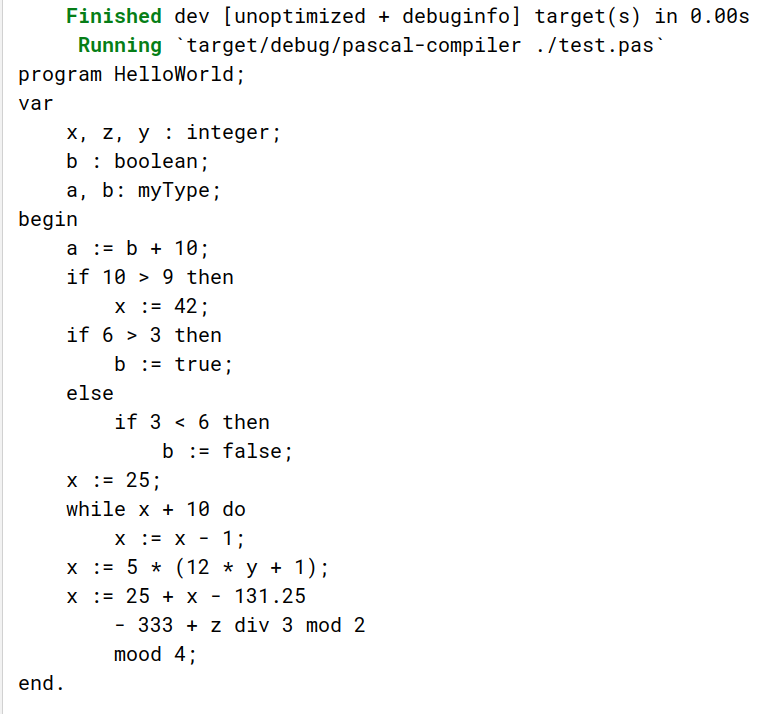

# Модуль ввода-вывода
Первое, с чего начинается работа любого компилятора - это считывание исходного текста
из некоторого источника (стандартный ввод, файл). Для этого реализуем отдельный компонент.

## Требования:
Составим требования к модулю ввода/вывода:
1. Считывание исходного кода происходит из **файла** (не stdin),
2. Считывание происходит постепенно (**построчно**),
3. Модуль ввода/вывода должен предоставлять интерфейс для **посимвольной** итерации,
4. Должна присутствовать возможность заглянуть на символ вперёд,

## Проектирование
При проектировании учтём идиоматический способ обработки ошибок в
Rust ‒ использование перечислимых типов `Result` или `Option`.
Механизма исключений нет, поэтому возможные ошибки передаются
в функциональном стиле - как вариант алгебраического типа данных.

По сути, компонент **не будет реализовывать часть вывода**, только
часть ввода. Прочитанные символы (или возникшие ошибки чтения)
будут передаваться "наверх" по цепочке вызовов. В сочетании
с семантикой перемещения Часть вывода будет находиться отдельно.

## Реализация модуля ввода/вывода
Полная реализация расположена в файле `src/io.rs`.

Компонент реализован в виде структуры `CharReader` со следующими полями:
```rust
pub struct CharReader {
    current_char: Option<char>,
    chars: Option<Vec<char>>,
    lines: Lines<BufReader<File>>,
    line_num: usize,
    col_num: usize,
}
```
- `current_char` - текущий (последний) просматриваемый символ
- `chars` - символы текущей (последней прочитанной) строки
- `lines` - итератор построчного буферизированного чтения из файла
- `line_num` - номер текущей просматриваемой строки
- `col_num` - номер текущего просматриваемого столбца (символа) в строке

`current_char` и `chars` имеют тип `Option<T>`. Когда файл прочитан полностью (или он изначально пуст),
принимают значение `None`, иначе `Some(T)`.

Конструктор (метод `new()`) принимает один аргумент - путь до сканируемого файла.
`new()` возвращает `Ok(CharReader)`, если файл существует, и `Err(std::io::Error)`, если при открытии произошла ошибка.

```rust
pub fn new(filename: String) -> Result<Self, Error> {
    let file = File::open(filename)?;

    let reader = BufReader::new(file);
    let mut lines = reader.lines();

    let chars: Option<Vec<char>> = match lines.by_ref().next() {
        Some(Ok(s)) => {
            let mut c: Vec<char> = s.chars().collect();
            c.push('\n');
            Some(c)
        }
        _ => None,
    };

    let line_num = 1;
    let col_num = 0;

    let current_char = match chars.as_ref() {
        Some(v) => Some(v[0]),
        _ => None,
    };

    let reader = Self {
        current_char,
        chars,
        lines,
        line_num,
        col_num,
    };
    Ok(reader)
}
```

Для посимвольного обхода реализована черта (trait) `Iterator`:
```rust
use std::iter::Iterator;

impl Iterator for CharReader {
    type Item = char;
    
    fn next(&mut self) -> Option<Self::Item> {
        match self.chars.as_ref() {
            // Достигнут конец последней считанной линии
            Some(v) if self.col_num + 1 == v.len() => {
                self.line_num += 1;
                self.col_num = 0;

                // Итерируемся до первой непустой строки или EOF
                loop {
                    match self.lines.by_ref().next() {
                        Some(Ok(s)) if s.len() > 0 => {
                            let mut c: Vec<char> = s.chars().collect();
                            c.push('\n');

                            self.current_char = Some(c[0]);
                            self.chars = Some(c);
                            break;
                        }
                        None => {
                            self.chars = None;
                            self.current_char = None;
                            break;
                        }
                        _ => (),
                    };
                }
            }
            Some(v) => {
                self.col_num += 1;
                self.current_char = Some(v[self.col_num]);
            }
            _ => {
                self.current_char = None;
            }
        };

        self.current_char
    }
}
```
Черты ("трейты") ‒ это ключевый механизм в языке Rust для реализации
интерфейсов. В языке отсутствует наследование (как и другие характерные
для ООП-языков механизмы), вместо этого используется принцип
Composition over Inheritance и механизм трейтов.

Для реализации трейта Iterator реализован метод `next()`, который, согласно интерфейсу, 
возвращает `Option<Item>`. `None` - сигнал исчерпания потока. В ином случае возвращается `Some(char)`.
`Item` - это тип данных внутри трейта. В данном случае это простой `char`. 
На каждом вызове метода мы передвигаем "курсор" на одну позицию, запоминая новый символ.
Если был достигнут конец строки, происходит переход на следующую, если она есть.


## Тестирование
Для тестирования будем итерироваться по символам и сразу выводить
их вместе с позицией через стандартные механизмы вывода в консоль.

Тестовая программа на языке Pascal:
```Pascal
program HelloWorld;
var
    x, z, y : integer;
    b : boolean;
    a, b: myType;
begin
    a := b + 10;

    if 10 > 9 then
        x := 42;

    if 6 > 3 then
        b := true;
    else
        if 3 < 6 then
            b := false;
    x := 25;


    while x + 10 do
        x := x - 1;

    x := 5 * (12 * y + 1);
    x := 25 + x - 131.25
        - 333 + z div 3 mod 2
        mood 4;
end.
```

Результат работы:


## Вывод ошибок и промежуточных результатов
Вместо отдельного модуля вывода использовались механизмы стандартного
вывода с реализацией интерфейсов (трейтов) `Display` и `Debug`.

Пример (реализация Display для ошибок):
```rust
impl fmt::Display for CompilerError {
    fn fmt(&self, f: &mut fmt::Formatter<'_>) -> fmt::Result {
        write!(
            f,
            "{} Error [{}:{}] {}",
            self.err_type, self.pos.0, self.pos.1, self.description
        )
    }
}
```

Другой пример (реализация Debug для структуры `IfStatement`):
```rust
impl fmt::Debug for IfStatement {
    fn fmt(&self, f: &mut fmt::Formatter<'_>) -> fmt::Result {
        f.debug_struct("IfStatement")
            .field("condition", &self.condition)
            .field("statement", &self.statement)
            .field("else", &self.else_statement)
            .finish()
    }
}
```

Примеры вывода:
```text
# Токен - результат работы лексического анализатора
Token { type: Integer(3), position: (25, 24) }

# SimpleExpression - одна из структур, используемых в парсере
SimpleExpression {
    term: Term {
        factor: Factor<Int>(Token { type: Integer(25), position: (17, 12) }),
        sub_term: None,
        term_type: "integer",
    },
    sub_expr: None,
    expr_type: "integer",
},
```

Подробнее затронутые выше структуры будут описаны в следующих частях отчёта.