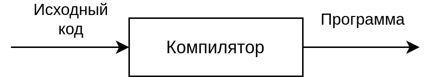

# Начало написания компилятора. Лексический анализ.
Компилятор - это компьютерная программа, транслирующая исходный код на одном формальном языке в другой,
чаще всего в машинный код для конкретной аппаратной платформы.

Если представлять компилятор как чёрный ящик, то получится следующее:

Принципы компиляции:
1. **Компилятор должен сохранять смысл компилируемой программы.**

Нет смысла пользоваться компилятором, который для корреткного исходного кода
генерирует некорректную программу. Сгенерированная программа должна делать
только то, что было написано на исходном языке;

2. **Компилятор должен улучшать входную программу некоторым заметным образом.**

Под улучшением в данном случае понимается как сама возможность выполнения на
целевом компьютере, так и внесение таких изменений, которые меняют исходный код
для достижения некоторого более оптимального представления (это может быть как
ускорение времени выполнения путём, например, поисков инвариантов в циклах,
удаления неиспользуемого кода, так и достижение более компактного представления,
занимающего меньше места на носителе).

## Структура компилятора
Перед тем, как начать реализацию, необходимо чётко разделить
весь компилятор на отдельные части в зависимости от назначения. Чтобы это сделать,
необходимо понять, на какие этапы делится сам процесс компиляции
(на текущий момент без углубления в детали).

Можно выделить следующие этапы:
1. Лексический анализ

Задача лексического анализа - разбить исходный текст на набор лексем (токенов) с построением
внутреннего представления.
Поток лексем затем передаётся на вход следующему компоненту - синтаксическому анализатору.
Компонент, который выполняет лексический анализ часто называется **сканнером** или **лексёром**.

2. Синтаксический анализ

Задача синтаксического анализа - сопоставление последовательности лексем с формальной
грамматикой языка.

3. Семантический анализ

Задача семантического анализа - проверить соответствие исходного текста
неформальным правилам языка. Иными словами, исходный текст должен
быть осмысленным.

4. Генерация

На этом этапе происходит генерация кода для целевой платформы/целевого языка.

Для каждого из этапов можно выделить отдельный компонент компилятора, а также
компонент ввода-вывода, постепенно считывающий исходный текст и передающий его на
вход анализатору.

Этапы могут выполняться последовательно или параллельно (с синхронизацией при необходимости).

**Проход** - это чтение исходного текста программы.

**Однопроходные** компиляторы просматривают весь исходный текст ровно один раз.
Ограничение - все идентификаторы должны быть описаны до использования.

## Проектирование лексического анализатора
TODO

## Реализация
Реализация выполнялась на языке Rust.

TODO
