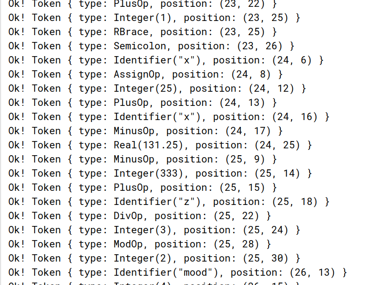
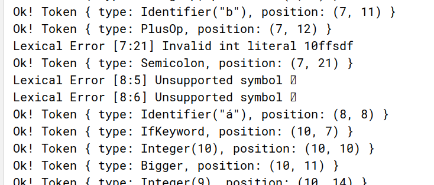

# Лексический анализатор
Символы, считанные из файла, поступают в лексический анализатор.
Задача анализатора - из отдельных символов собрать лексемы:
- Литералы (числа, строки),
- Ключевые слова
- Идентификаторы
- Специальные символы

Лексический анализатор должен обрабатывать последовательность символов,
выделяя из неё лексемы (токены) и обрабатывая лексические ошибки.

Лексический анализатор должен предоставлять интерфейс для обхода
выделенных токенов, как последовательности, то есть реализовывать
интерфейс итератора.

## Хранение токенов
Для хранения токенов введём структуру `Token`, а также перечислимый
тип `TokenType`:
```rust
pub struct Token {
    pub(crate) token: TokenType,
    pub(crate) pos: (usize, usize),
}

pub enum TokenType {
    Integer(i32),
    Identifier(String),
    StringLiteral(String),
    Real(f32),
    ProgramKeyword,
    VarKeyword,
    BeginKeyword,
    ...
}

```
Enum в Rust может быть параметризованным. Воспользуемся этим, чтобы хранить
извлечённые литералы вместе с типом токена. Часть элементов перечислимого типа имеют кортежную структуру ‒
аргумент, используемый для создания. Например, числовые или строковые
литералы. Для внутреннего использования также введён дополнительный токен
EOF ‒ символ конца потока, используемый во внутренней логике работы
анализатора.

Помимо типа токена также храним его позицию в тексте ‒ это пригодится
на последующих этапах анализа и обработки ошибок.

## Реализация лексического анализатора
Для представления лексических ошибок создана отдельная структура `CompilerError` и enum `ErrorType`:
```rust
pub enum ErrorType {
    Lexical,
    Syntax,
    Semantic,
}

pub struct CompilerError {
    description: String,
    pos: (usize, usize),
    err_type: ErrorType,
}

impl CompilerError {
    pub fn new(description: String, pos: (usize, usize), err_type: ErrorType) -> Self {
        Self {
            description,
            pos,
            err_type,
        }
    }
    ...
}
```
Структура содержит строковое описание ошибки, её тип, а также позицию в файле, где она произошла.

Лексический анализатор задан в виде структуры:
```rust
pub struct Lexer {
    chars: CharReader,
}


impl Lexer {
    pub fn new(chars: CharReader) -> Self {
        Self { chars }
    }
    …
}

```

Для обхода токенов реализован trait `Iterator`:
```rust
impl Iterator for Lexer {
    type Item = Result<Token, LexicalError>;

    fn next(&mut self) -> Option<Self::Item> {
        self.skip_ws();

        let token = match self.chars.by_ref().current_char() {
            Some(ch) => match ch {
                '0'..='9' => self.number(),
                '+' | '-' | '*' | ':' => self.operator(),
                _ if ch.is_alphanumeric() => self.maybe_keyword(),
                _ => self.symbol(),
            },
            None => Ok(Token::EOF),
        };

        match token {
            Ok(Token::EOF) => None,
            _ => Some(token),
        }
    }
}
```

В методе `next()` мы обходим посимвольно исходный файл при помощи
`CharReader`, который тоже постепенно считывает сам исходный файл.
В зависимости от символа запускаем обработчик конкретной лексемы или группы лексем.

Обработка чисел запускается при выявлении цифры в начале очередной выделяемой лексемы.
Если в процессе была найдена точка, то пытаемся обработать последовательность
как вещественное число, иначе - как целочисленное. Если при обработке
возникла ошибка, то создаётся соответствующая лексическая ошибка и
передаётся как результат обработки. Если числовой литерал корректен,
то возвращается соответствующий токен.

Обработка чисел:
```rust
impl Lexer {
    …
    fn number(&mut self) -> Result<Token, LexicalError> {
        let mut num = String::new();
        let mut is_real = false;

        loop {
            match self.chars.by_ref().current_char() {
                Some(ch) if ch.is_digit(10) => num.push(ch),
                Some(ch) if ch == '.' => {
                    num.push(ch);
                    is_real = true;
                }
                Some(ch) if ch.is_whitespace() => break,
                Some(ch) if ch.is_alphanumeric() => {
                    // Consume everything until whitespace or EOF
                    num.push(ch);

                    while let Some(ch) = self.chars.next() {
                        if ch.is_whitespace() {
                            break;
                        } else {
                            num.push(ch);
                        }

                        break;
                    }
                }
                _ => break,
            }

            self.chars.by_ref().next();
        }

        if is_real {
            let parsed = num.parse::<f32>();

            match parsed {
                Ok(f) => Ok(Token::Real(f)),
                _ => {
                    let pos = self.chars.position();
                    Err(LexicalError::new(
                        String::from(format!("Invalid real literal {}", num)),
                        pos.0,
                        pos.1,
                    ))
                }
            }
        } else {
            let parsed = num.parse::<i32>();

            match parsed {
                Ok(i) => Ok(Token::Integer(i)),
                _ => {
                    let pos = self.chars.position();

                    Err(LexicalError::new(
                        String::from(format!("Invalid int literal {}", num)),
                        pos.0,
                        pos.1,
                    ))
                }
            }
        }
    }
    …
}
```

Пример - обработка идентификаторов и ключевых слов:
```rust
fn maybe_keyword(&mut self) -> Result<Token, LexicalError> {
    if self.chars.by_ref().current_char().is_none() {
        Ok(Token::EOF)
    } else {
        let mut s = String::new();
        s.push(self.chars.by_ref().current_char().unwrap());

        loop {
            match self.chars.next() {
                Some(ch) if ch.is_alphanumeric() => s.push(ch),
                _ => break,
            }
        }

        match s.to_lowercase().as_str() {
            "div" => Ok(Token::DivOp),
            "mod" => Ok(Token::ModOp),
            "program" => Ok(Token::ProgramKeyword),
            "begin" => Ok(Token::BeginKeyword),
            "end" => Ok(Token::EndKeyword),
            "integer" => Ok(Token::IntegerKeyword),
            "real" => Ok(Token::RealKeyword),
            "var" => Ok(Token::VarKeyword),
            _ => Ok(Token::Identifier(s)),
        }
    }
}
```

## Тестирование
Проверим на следующем тексте программы:
```Pascal
program HelloWorld;
var
    x, z, y : integer;
    b : boolean;
    a, b: myType;
begin
    a := b + 10;

    if 10 > 9 then
        x := 42;

    if 6 > 3 then
        b := true;
    else
        if 3 < 6 then
            b := false;
    x := 25;


    while x + 10 do
        x := x - 1;

    x := 5 * (12 * y + 1);
    x := 25 + x - 131.25
        - 333 + z div 3 mod 2
        mood 4;
end.
```

Результат работы:


Добавим в текст emoji 🍔 и символ с диакритическим знаком:


Как видим, emoji не поддерживаются, также у нас присутствует
неправильный литерал (или идентификатор, начинающийся с цифр).