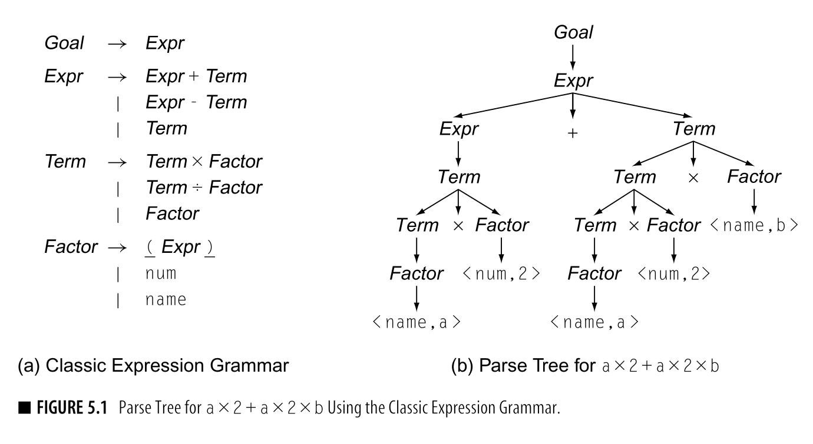

# Синтаксический анализатор (парсер)
Задача синтаксического анализатора ‒ проверка исходной программы
на соответствие формальным правилам (грамматике) языка программирования.
Грамматика, как правило, описывается с помощью формы Бэкуса-Наура (BNF).

Правила в BNF имеют вид
`<S> ::= L`

Где S - это нетерминальный символ в грамматике, а L - 
состоит из терминальных и нетерминальных символов.

Примеры BNF для языка Pascal:
```text
<relational operator> ::= <|>|>=|<=|=|<>
<expression> ::= <simple expression> | <simple expression> <relational operator> <simple expression>
<program> ::= program <identifier> ; <block> .
<identifier> ::= <letter > {<letter or digit>}
<letter or digit> ::= <letter> | <digit>
<type definition> ::= <identifier> = <type>
<type> ::= <simple type> | <structured type> | <pointer type>
<statementPart> ::= <compoundStatement>
<compound statement> ::= begin <statement> {; <statement> } end;
<if statement> ::= if <expression> then <statement> | if <expression> then <statement> else <statement>
<while statement> ::= while <expression> do <statement>
```

Базовая структура простой Pascal-программы:
```pascal
program <имя программы>;
type
    <идентификатор> = <значение>;
    {<идентификатор> = <значение>;}
var
    <id1>{, <id>} : <идентификатор типа>;
begin
    ...
end.

```

Основная идея реализации синтаксического анализатора заключается в
написании для каждой поддерживаемой языковой конструкции функции,
тело которой состоит из обработки L.

## Выбор промежуточного представления[1]
Один из ключевых выбор при написании компилятора вообще и парсера
в частности - это промежуточное представление исходной программы
в процессе обработки. Особенно это важно для многопроходных
компиляторов, так как необходимо обеспечить более эффективный
доступ к элементам представления. Транспайлеры могут использовать
представление, наиболее близкое к целевому языку. Другие компиляторы,
целевой платформой для которых являются различные микроконтроллеры,
могут использовать промежуточное представление, близкое к asm
микроконтроллера.

Компилятор может использовать как одно представление на всех
стадиях обработки, так и несколько.

Виды промежуточного представления:
1. Графическое: программа представляется в виде графа (в частности, в виде дерева),
2. Линейное: программа представляется в виде псевдокода абстрактной машины,
3. Гибридное

В написанной реализации использовалось графическое промежуточное
представление, а именно в виде дерева (формально ближе к дереву
парсинга, однако с отбрасыванием некоторых символов, смысл которых
неявно содержится в самой древовидной структуре).



Одно из преимуществ графического представления ‒ это интуитивное
кодирование всей работы программы с учётом приоритетов операций,
которые представлены с помощью уровня вложенности. Если бы
требовалось писать оптимизирующий многопроходный компилятор, то
для полного воспроизведения порядка команд достаточно было бы
сделать полный обход дерева в глубину.

## Используемые структуры
Для реализации дерева были описаны следующие структуры и перечислимые типы:
```rust
pub enum Factor {..}
pub enum AdditiveOp {..}
pub enum MultiplicativeOp {..}
pub enum RelationalOp {..}
pub enum Expression {..}
pub enum Statement {..}

pub struct Identifier {..}
pub struct VarAssignment {..}
pub struct Term {..}
pub struct SubTerm {..}
pub struct SubExpression {..}
pub struct SimpleExpression {..}
pub struct RelationalExpression {..}
pub struct TypeSection {..}
pub struct Compound {..}
pub struct TypeDeclaration {..}
pub struct VarDeclaration {..}
pub struct VarSection {..}
pub struct Program {..}
pub struct IfStatement {..}
pub struct WhileLoop {..}
```

Для каждой структуры для удобного отладочного вывода реализована
черта `Debug`. Пример:
```rust
impl fmt::Debug for Program {
    fn fmt(&self, f: &mut fmt::Formatter<'_>) -> fmt::Result {
        f.debug_struct("Program")
            .field("identifier", &self.identifier)
            .field("var_section", &self.var_section)
            .field("type_section", &self.type_section)
            .field("compound", &self.compound)
            .finish()
    }
}
```

Использование `debug_struct()` позволяет добиться красивого вывода с
учётом отступа во вложенных структурах.

Для хранения вложенных структур в куче использовался контейнер `Box`.
`Box` можно интерпретировать как `unique_ptr`, то есть владелец структуры
всегда один ‒ это родитель. Технически, без использования оптимизаций
структура сначала выделяется на стеке, а только затем копируется в
кучу ‒ это ограничения Safe Rust. Выделить произвольную область область
сразу в куче без оптимизаций возможно с использованием Unsafe Rust. Но это
детали реализации. На практике повсеместно используются контейнеры с 
учётом этого ограничения языка.

Иерархия структур:

Program
- Identifier
- [VarSection]
  - {VarDeclaration}
    - Identifier
- [TypeSection]
  - {TypeDeclaration}
- Compound (так как используется подмножество Pascal, полная иерархия была несколько сокращена)
  - {Statement}
    - VarAssignment
      - Identifier
      - Expression
        - SimpleExpression
          - Term
            - Factor
            - SubTerm
              - MultiplicativeOp
              - Factor
              - SubTerm
          - SubExpression
            - AdditiveOp
            - Term
            - SubExpression
        - RelationalExpression
          - SimpleExpression (левая и правая части)
          - RelationalOp
    - IfStatement
      - Expression
      - Statement (+ ветка else)
    - WhileLoop
      - Expression
      - Statement

Структура самого парсера:
```rust
pub struct Parser {
    lexer: Peekable<Lexer>,
    current_token: Option<Result<Token, CompilerError>>,
    current_pos: (usize, usize),
    pub(crate) errors: Vec<CompilerError>,
}
```
Храним лексический анализатор (Peekable - стандартная реализация
для итераторов: при вызове peek() считывается очередной символ, но
старый не удаляется, а сохраняется в кэш, при очередном вызове next()
поток не будет нарушен).

Также храним текущий токен, позицию и буфер ошибок. В текущий реализации, парсер - это
самая верхняя используемая структура, поэтому буфер ошибок находится
в нём.

Реализованы методы:
```rust
fn next_token(&mut self) {}
fn parse_factor(&mut self) -> Result<Factor, CompilerError> {}
fn parse_term(&mut self) -> Result<Term, CompilerError> {}
fn parse_sub_term(&mut self) -> Result<Option<Box<SubTerm>>, CompilerError> {}
fn parse_comma(&mut self) -> Result<(), CompilerError> {}
fn parse_type_declaration(&mut self) -> Result<Vec<TypeDeclaration>, CompilerError> {}
fn parse_type_section(&mut self) -> Result<TypeSection, CompilerError> {}
fn parse_var_declaration(&mut self) -> Result<Vec<VarDeclaration>, CompilerError> {}
fn parse_var_section(&mut self) -> Result<VarSection, CompilerError> {}}
fn parse_period(&mut self) -> Result<(), CompilerError> {}
fn parse_program(&mut self) -> Result<Program, CompilerError> {}
fn parse_identifier(&mut self) -> Result<Identifier, CompilerError> {}
fn parse_additive_op(&mut self) -> Result<AdditiveOp, CompilerError> {}
fn parse_sub_expr(&mut self) -> Result<Option<SubExpression>, CompilerError> {}
fn parse_statement(&mut self) -> Result<Statement, CompilerError> {}
fn parse_expr(&mut self) -> Result<Expression, CompilerError> {}
fn parse_if(&mut self) -> Result<(), CompilerError> {}
fn parse_then(&mut self) -> Result<(), CompilerError> {}
fn parse_else(&mut self) -> Result<Option<()>, CompilerError> {}
fn parse_conditional(&mut self) -> Result<IfStatement, CompilerError> {}
fn parse_while(&mut self) -> Result<(), CompilerError> {}
fn parse_do(&mut self) -> Result<(), CompilerError> {}
fn parse_while_loop(&mut self) -> Result<WhileLoop, CompilerError> {}
fn parse_compound(&mut self) -> Result<Compound, CompilerError> {}
fn skip_until_starters(&mut self) {}
fn parse_relational_op(&mut self) -> Result<RelationalOp, CompilerError> {}
fn parse_simple_expr(&mut self) -> Result<SimpleExpression, CompilerError> {}
fn parse_assignment(&mut self) -> Result<VarAssignment, CompilerError> {}
pub fn parse(&mut self) -> Result<Program, CompilerError> {}
fn parse_multiplicative_op(&mut self) -> Result<MultiplicativeOp, CompilerError> {}
```

Точкой входа является метод `parse()`:
```rust
pub fn parse(&mut self) -> Result<Program, CompilerError> {
    self.parse_program()
}
```
При вызове начинается построение дерева на основе потока лексем.

**Результат работы** синтаксического анализатора ‒ древовидное представление
исходной программы.


## Обработка ошибок и их нейтрализация
Для обработки ошибок используется тип данных `Result` на каждом из
этапов парсинга. Это позволяет обеспечить передачу ошибок наверх по
иерархии вызовов. Если возникает ошибка, то мы передаём её наверх
до уровня, где возможна нейтрализация. Для этого очень удобно
использовать оператор `?`. Данный оператор в Rust автоматически
передаёт `Err` в качестве возвращаемого значения из места вызова.

Фрагмент для демонстрации работы:
```rust
fn parse_term(&mut self) -> Result<Term, CompilerError> {
  let factor = Box::new(self.parse_factor()?);
  let sub_term = self.parse_sub_term()?;
  ...
}
```

В данном случае если возникла ошибка при парсинге фактора или подтерма
соответствующая ошибка будет сразу передана в качестве return-значения.
Если всё в порядке, то в переменные будут записаны соответственно Factor и
SubTerm.

Идея нейтрализации - при возникновении ошибки пропускать лексемы
до тех пор, пока не будет найдена лексема, соответствующая набору
стартовых.

При возникновении ошибки внутри поддерева невалидным объявляется
всё поддерево. То есть если, например, была выявлена синтаксическая
ошибка в секции операторов, то мы продолжаем парсинг со следующего начала оператора (если оно есть).


## Примеры работы
Исходный код:
```pascal
program HelloWorld;
var
    x : integer;
begin
    x := 5 + 3;
end.
```

Результат:
```text
Program {
    identifier: Identifier {
        name: Token {
            type: Identifier(
                "HelloWorld",
            ),
            position: (
                1,
                19,
            ),
        },
    },
    var_section: Some(
        VarSection {
            declarations: [
                VarDeclaration {
                    id: Identifier {
                        name: Token {
                            type: Identifier(
                                "x",
                            ),
                            position: (
                                3,
                                6,
                            ),
                        },
                    },
                    type_name: Identifier {
                        name: Token {
                            type: Identifier(
                                "integer",
                            ),
                            position: (
                                3,
                                16,
                            ),
                        },
                    },
                },
            ],
        },
    ),
    type_section: None,
    compound: Compound {
        statements: [
            Simple Statement {
                value: VarAssignment {
                    identifier: Identifier {
                        name: Token {
                            type: Identifier(
                                "x",
                            ),
                            position: (
                                5,
                                6,
                            ),
                        },
                    },
                    value: Simple SimpleExpression {
                        term: Term {
                            factor: Factor<Int>(Token { type: Integer(5), position: (5, 11) }),
                            sub_term: None,
                            term_type: "integer",
                        },
                        sub_expr: Some(
                            SubExpression {
                                op: Plus <+>,
                                term: Term {
                                    factor: Factor<Int>(Token { type: Integer(3), position: (5, 15) }),
                                    sub_term: None,
                                },
                                sub_expr: None,
                            },
                        ),
                    },
                },
            },
        ],
    },
}

Process finished with exit code 0
```

Примеры выявления ошибок:
```pascal
program HelloWorld;
var
    x : integer;
begin
    x := 5  3;
end.
```

```text
Parsed program!
Errors:
Syntax Error [5:14] Expected *, div or mod, found Token { type: Integer(3), position: (5, 14) }
Program {
    identifier: Identifier {
        name: Token {
            type: Identifier(
                "HelloWorld",
            ),
            position: (
                1,
                19,
            ),
        },
    },
    var_section: Some(
        VarSection {
            declarations: [
                VarDeclaration {
                    id: Identifier {
                        name: Token {
                            type: Identifier(
                                "x",
                            ),
                            position: (
                                3,
                                6,
                            ),
                        },
                    },
                    type_name: Identifier {
                        name: Token {
                            type: Identifier(
                                "integer",
                            ),
                            position: (
                                3,
                                16,
                            ),
                        },
                    },
                },
            ],
        },
    ),
    type_section: None,
    compound: Compound {
        statements: [],
    },
}
```

Как видно, единственный statement был инвалидирован в
в конечном дереве не присутствует.

Далее без вывода дерева:
```pascal
program Test;
var
  z : real;
begin
  z = 25; 
end.
```

```text
Syntax Error [5:7] Expected :=, found Token { type: Eq, position: (5, 7) }
```

```pascal
program HelloWorld;
var
    x, z, y : integer;
begin
    x := 25 + x - 131.25
        - 333 + z div 3 mod 2
        mood 4;
end.
```

```text
Syntax Error [7:13] Expected *, div or mod, found Token { type: Identifier("mood"), position: (9, 13) }
```

```pascal
program HelloWorld;
var
    b : myType;
begin
    if 6 > 3
        b := true;
end.
```

Не совсем корректный текст, так как в процессе разбора правой части условия
происходит переход к следующему токену, а это b. Тем не менее, это тоже
синтаксическая ошибка => условный оператор инвалидирован
```text
Syntax Error [8:10] Expected *, div or mod, found Token { type: Identifier("b"), position: (8, 10) }
```

```pascal
program HelloWorld;
var
    x : integer;
begin
    x := (5 + 3;
end.
```
```text
Syntax Error [5:16] Expected closing brace, got Token { type: Semicolon, position: (5, 16) }
```

```pascal
program Test;
var
    x : integer;
begin
    x := (5 + *3);
end.
```
```text
Syntax Error [5:15] Expected literal or identifier, found Token { type: MulOp, position: (5, 15) }
```

```pascal
program Test
var
    x : integer;
begin
    x := (5 + 3);
end.
```
```text
Syntax Error [2:4] Expected ';', found Token { type: VarKeyword, position: (2, 4) }
```

```pascal
progra m ;
var
    x : integer;
begin
    x := (5 + 3);
end.
```

```text
Syntax Error [1:7] Expected 'PROGRAM', found Token { type: Identifier("progra"), position: (1, 7) }
```

```pascal
program ;
type
var
    x : integer;
begin
    x := 5 + 3;
end.
```
```text
Syntax Error [1:9] Expected identifier, found Token { type: Semicolon, position: (1, 9) }
```

```pascal
program Test;
var
    x : integer;
begin
    sdf + 123 f;
    x := (5 + *3);
end.
```
```text
Syntax Error [5:9] Expected :=, found Token { type: PlusOp, position: (5, 9) }
Syntax Error [6:15] Expected literal or identifier, found Token { type: MulOp, position: (6, 15) }
```

```pascal
program Test;
type
    d, f fff;
    a : integer;
var
    x : integer;
begin
    sdf + 123 f;
    x := (5 + *3);
end.
```

```pascal
program Test;
type
    a : integer;
var
    x : integer;
begin
    while true
        x := 5;
end.
```

Тоже не совсем корректный вид ошибки: после true продолжился парсинг выражения
Тем не менее, синтаксическая ошибка (текст ошибки не был обновлён после добавления логических операторов)
```text
Syntax Error [8:10] Expected *, div or mod, found Token { type: Identifier("x"), position: (8, 10) }
```

```pascal
program Test;
var
    x : integer;
begin
    x := 25;

    if x > 25 < 50 then
        x := 50;
end.
```

```text
Syntax Error [7:15] Expected 'Then', found Token { type: Less, position: (7, 15) }
```

1 - Engineering a Compiler, глава 5